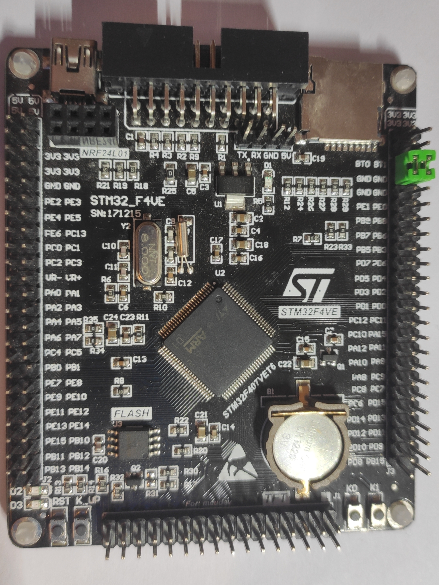
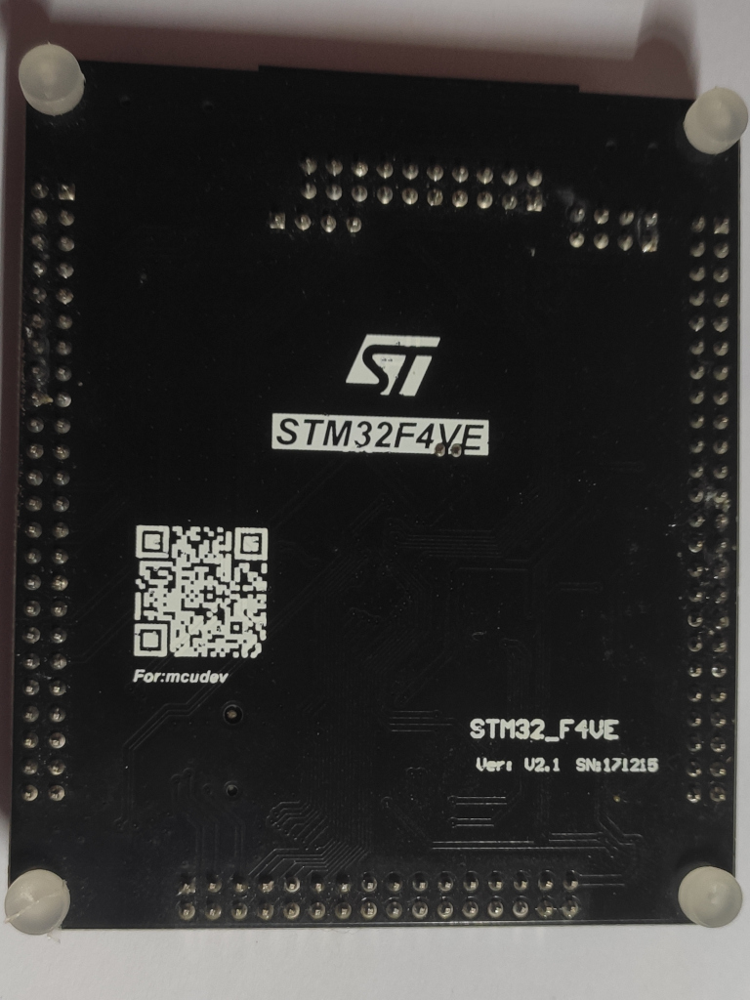
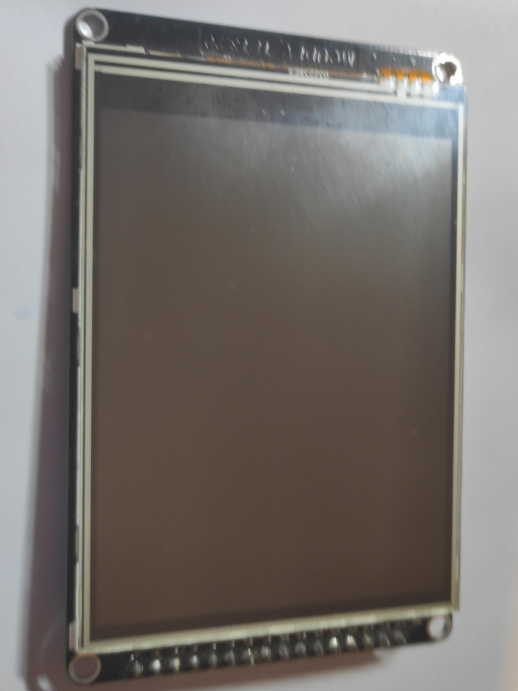
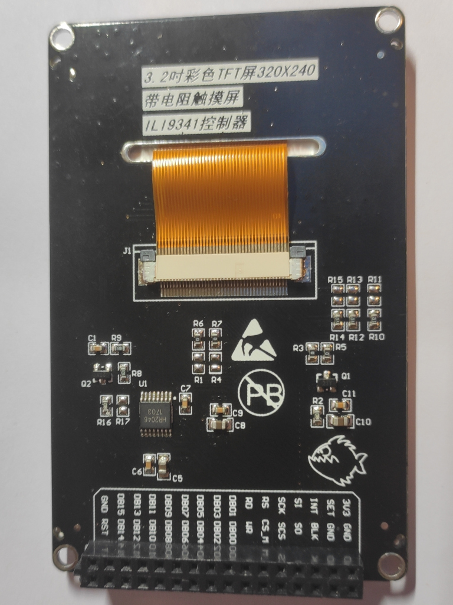
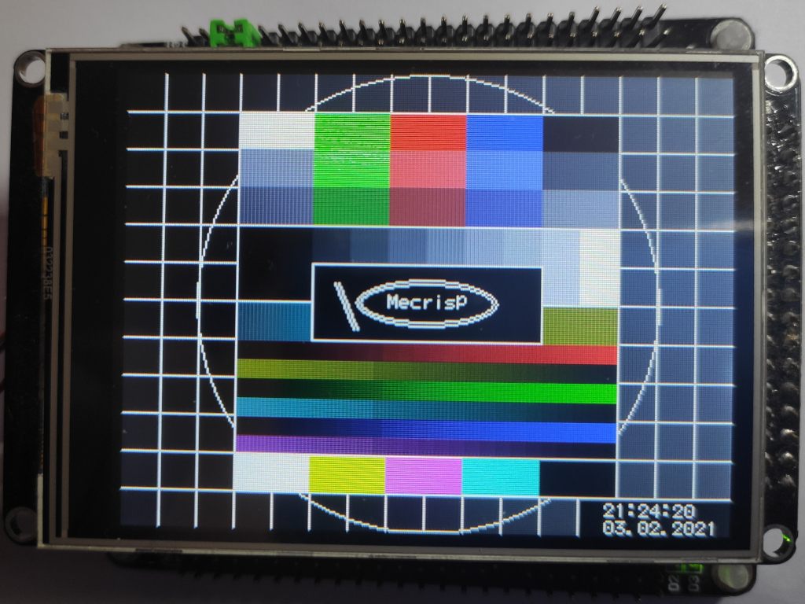

# Mecrisp forth for stm32f407vet6 black board (with optional ili9341 fsmc tft display)

This compilation adds words and definitions and makes it easier to use the hardware of that board.
board | back | tft |tft back
------|------|-----|--------
 |  |  | 

## console connection

serial connection:
 - USART1 PA9 - TX, PA10 - RX (extra serial header)

(usb-connection is currently not implemented)

## install via usb with dfu-util

I am recommending folie from Jean Claude Wippler as connection tool to the board. 
He descibed this tool here: https://jeelabs.org/article/1718b/
Currently it is hosted inside this archive: https://github.com/jcw/jcw.github.io/blob/main/zips/embello-2020-03-31.zip)

```bash
\ flash forth kernel
sudo dfu-util  -a 0 -d 0483:df11 -s 0x8000000:mass-erase:force -D stm32f407-ra/mecrisp-stellaris-stm32f407.bin

# start serial connection to board, choose correct port when asked
folie -r 

\ load drivers into flash:
compiletoflash
\ words for most board hardware:
!s myinit.fs
\ optional words for fsmc tft:
!s myinit_tft.fs
compiletoram
```

## Driver for supplied FSMC-display

There is an nice TFT-display with touch avaiable for this board. I wrote forth words (driver) for that.

**hardware driver:**
 - lib/ili9341_fsmc.fs 
(made by me)

**line/ellipse/circle:**
 - ../lib/graphic/graphics.fs
(derived from mecrisp:/common/graphics.txt)

**character writer with 8x6 font:**
 - lib/font8x6.fs 
(font and words are derived from jcw-flib:/mecrisp/graphics.txt, adaptation/optimisation to this tft done by me)

(touch sensor is currently not implemented)

## Demo for fsmc TFT-display and onboard RTC

Please set time and date according to documentation in rtc.fs.

Code:
```forth
21 24 20 rtc-set-time
21 3 02 03 rtc-set-date
```

Then import demo.fs via folie and start demo. 
!s demo.fs
demo
```

You should get the following output:


